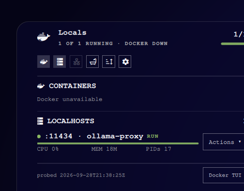

# wszaq.locals

Omarchy bar widget that **auto-discovers** Docker containers and localhost listeners, groups them, and lets you start / stop / pause / restart from an **Actions** menu.



## Pages

- [[Install]]
- [[Controls]]
- [[Autostart]]
- [[Configuration]]
- [[Screenshots]]
- [[Troubleshooting]]

## Quick install

```bash
omarchy plugin add https://github.com/wszaq/omarchy-locals.git --enable
omarchy bar move wszaq.locals --before omarchy.monitor
```

Plugin id: `wszaq.locals` · Author: **wszaq** · License: MIT

Repo: https://github.com/wszaq/omarchy-locals
